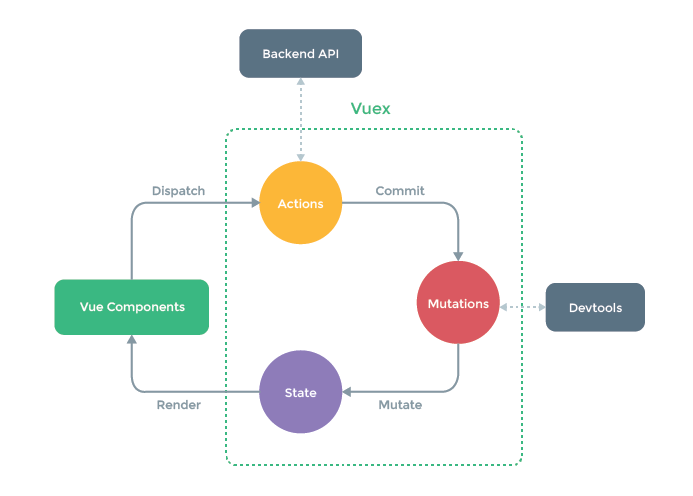

# store 폴더 정의 및 규칙
***

1. Vuex의 store속성과 관련된 내용은 여기에 추가한다.
2. 원래 main.js에 기술해도 되지만 main.js는 웹의 전체적인 설정을 확인할 수 있는 곳인데   
   이런 주체가 흐려지게 된다. 때문에 해당 Directive에 정리한다.

> Vuex : 상태관리 라이브러리    
> 여기서 말하는 상태의 의미는 컴포넌트간에 공유되는 데이터속성   

##[What is Vuex][googlelink] / [Vuex Post][post]

[googlelink]: https://vuex.vuejs.org/
[post]: https://joshua1988.github.io/web-development/vuejs/vuex-start/

##Vuex Data Flow


NewsView의 현재 동작순서
1. ```this.$store.dispatch('FETCH_NEWS', 'news/1.json');```
   * Vue Component에서 dispatch 동작
2. ```type.commit('SET_FETCH', response.data);```
   * store에 있는 actions에 있는 'FETCH_NEWS'를 작동
   * 'FETCH_NEWS'에 있는 'fetchList'가 동작한 뒤의 함수(then)에서 받아온 데이터를   
     mutations에 있는 'SET_FETCH'에 commit작업을 한다.
3. ```state.newsArray = payload;```
   * state에 있는 newsArray에 commit한 데이터를 이식한다.
4. ```const newsArray = this.$store.state.newsArray;```
   * state에 있는 newsArray를 NewsView Component에 있는 'newsArray'라는 변수에 할당한다.


    
